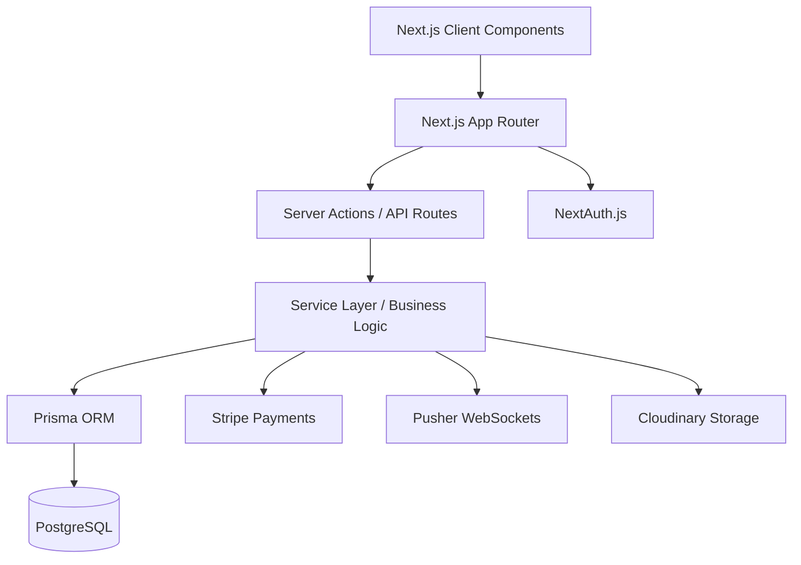

# AuraRent - Premium Smart Rental SaaS Platform

AuraRent is a sophisticated, end-to-end property management and rental marketplace designed for the modern housing economy. Built with a focus on high performance, secure transactions, and real-time user engagement, this platform demonstrates a senior-level full-stack architecture suitable for both commercial SaaS deployment and enterprise-grade portfolios.

---

## Architecture Overview



---

## Key Features

- **Multi-Role Ecosystem**: Dedicated, secure experience for Tenants, Landlords, and Administrators.
- **Real-Time Messaging**: Instant chat infrastructure powered by Pusher, featuring persistent history and typing indicators.
- **Secure Financial Layer**: 100% compliant payment processing via Stripe, including invoices and transaction history.
- **Advanced Discovery**: High-performance property search with dynamic filtering, maps, and geolocation.
- **Intelligence Dashboards**: Role-specific analytics (ROI for Landlords, Rental history for Tenants, Global moderation for Admins).
- **Trust & Reviews**: A weighted verification system for users and properties to ensure community safety.

---

## Technical Stack

- **Framework**: Next.js 15+ (App Router, Server Actions, Turbopack)
- **Language**: TypeScript (Strict Mode)
- **Database**: PostgreSQL with Prisma ORM
- **Styling**: Tailwind CSS & Vanilla CSS (Glassmorphism UI)
- **Animations**: Framer Motion
- **Authentication**: NextAuth.js (JWT Strategy)
- **Infrastructure**: Stripe (Payments), Pusher (WebSockets), Cloudinary (Images)

---

## Architectural Highlights

- **Service-Oriented Logic**: Business logic is encapsulated in a dedicated service layer to ensure maintainability and testability.
- **Stateless Authentication**: Utilizes JWT-based sessions for scalable, serverless-ready user management.
- **Optimized Performance**: Leverages Next.js static generation (SSG) for fast initial loads and dynamic rendering (SSR) for real-time data.
- **Schema-Driven Design**: Robust Prisma schema managing complex relationships between Users, Properties, Bookings, and Conversations.

---

## Getting Started

### Prerequisites

- Node.js 18+
- PostgreSQL Instance
- Stripe & Pusher API Keys

### Installation

1. **Clone the repository**
   ```bash
   git clone https://github.com/ThebeLedwaba/-AuraRent.git
   cd aurarent
   ```

2. **Install dependencies**
   ```bash
   npm install
   ```

3. **Environment Setup**
   Create a .env file based on the provided template:
   ```env
   DATABASE_URL="your-postgresql-url"
   NEXTAUTH_SECRET="your-secret"
   PUSHER_APP_ID="your-id"
   STRIPE_SECRET_KEY="your-key"
   ```

4. **Database Sync**
   ```bash
   npx prisma db push
   ```

5. **Run Development Server**
   ```bash
   npm run dev
   ```

---

## Portfolio Impact

This project showcases the ability to:
- Handle complex business logic and state management.
- Integrate multiple third-party APIs (Stripe, Pusher, Cloudinary).
- Design and implement a premium, responsive UI/UX.
- Manage data integrity with advanced PostgreSQL/Prisma relations.

---

*Built with precision for the future of urban living.*
